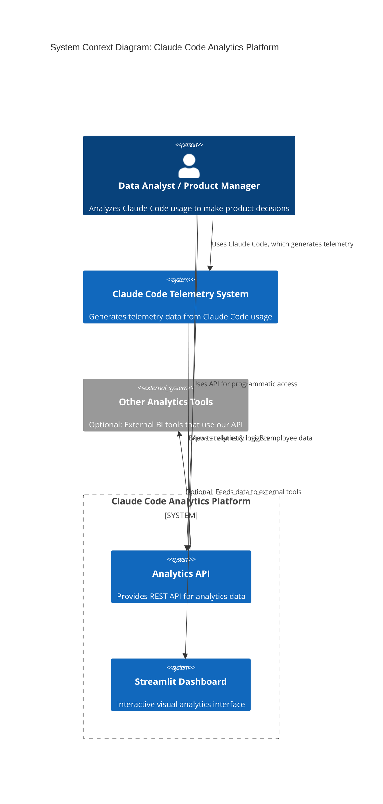
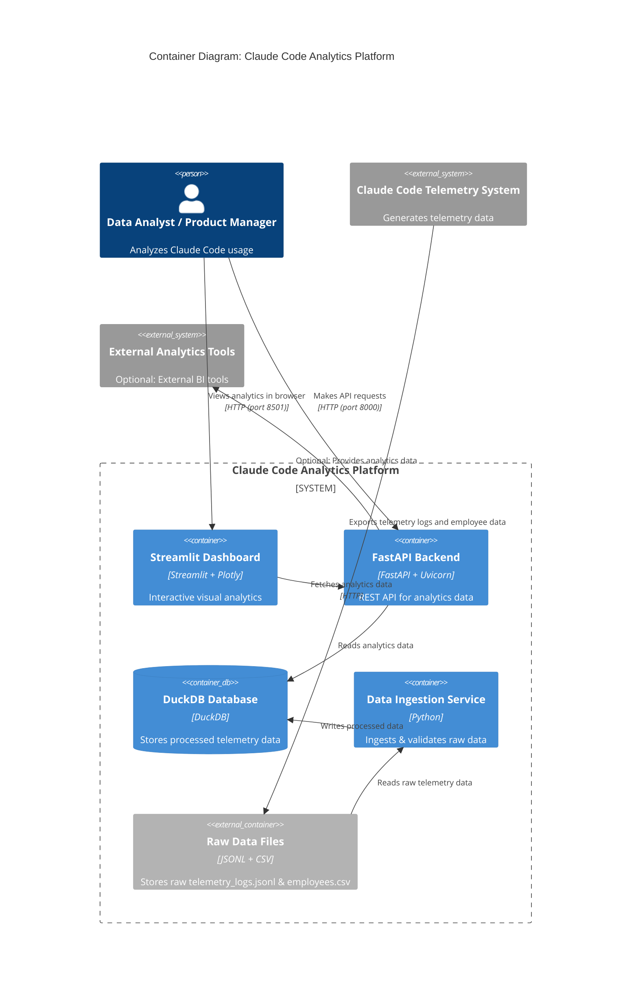
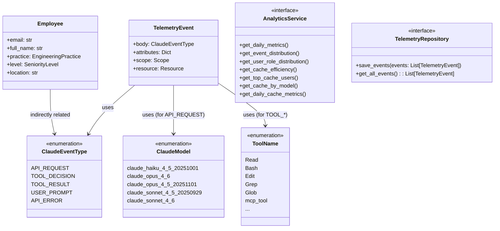
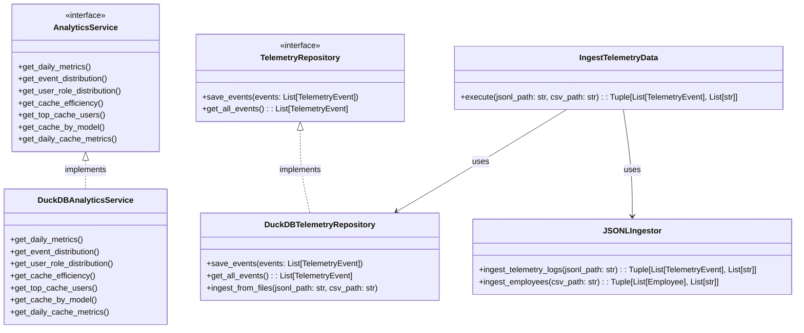

# C4 Model: Claude Code Analytics Platform

## Overview
C4 model is a way to visualize software architecture at 4 levels of abstraction, from high-level system context down to individual code components.

---

## Level 1: System Context
Shows the system as a whole and how it interacts with external entities.

### Key Elements:
- **User**: Data Analyst or Product Manager who wants to analyze Claude Code usage
- **Claude Code Telemetry System**: The source of our data (telemetry logs and employee info)
- **Analytics Platform**: Our system that processes data and provides insights (API + Dashboard)
- **Other Analytics Tools**: Optional external BI tools that can use our API

---

## Level 2: Container
Breaks the system into major containers (applications, databases, etc.) and shows how they interact.

### Key Containers:
- **Streamlit Dashboard**: Interactive web interface for visualizing analytics
- **FastAPI Backend**: REST API for programmatic access to analytics data
- **DuckDB Database**: File-based analytical database for processed telemetry
- **Data Ingestion Service**: Processes raw data, validates it, and loads into DuckDB
- **Raw Data Files**: Stores the original telemetry_logs.jsonl and employees.csv

---

## Level 3: Component
Breaks the containers into major components and shows how they interact. We'll focus on the core containers.

### Analytics Platform Core Components (Domain + Application + Infrastructure)

```mermaid
graph TB
    subgraph "FastAPI Backend"
        api_routes[API Routes<br/>FastAPI]
    end
    
    subgraph "Streamlit Dashboard"
        dashboard_pages[Dashboard Pages<br/>Streamlit + Plotly]
    end
    
    subgraph "Analytics Core"
        domain_models[Domain Models<br/>Pydantic v2]
        ports[Ports/Interfaces<br/>Python ABCs]
        use_cases[Use Cases<br/>IngestTelemetryData]
        
        subgraph "Infrastructure Adapters"
            duckdb_repo[DuckDB Repository]
            analytics_service[Analytics Service]
            jsonl_ingestor[JSONL Ingestor]
        end
    end
    
    subgraph "Data Layer"
        duckdb[(DuckDB Database)]
        raw_files[Raw Data Files]
    end
    
    api_routes --> analytics_service
    dashboard_pages --> api_routes
    use_cases --> duckdb_repo
    duckdb_repo --> duckdb
    use_cases --> jsonl_ingestor
    jsonl_ingestor --> raw_files
    analytics_service --> duckdb
```

### Key Components:
1. **Domain Layer**:
   - Domain Models: Pydantic v2 models for TelemetryEvent, Employee, ClaudeEventType, etc.
   - Ports: Interfaces (ABCs) for AnalyticsService and TelemetryRepository

2. **Application Layer**:
   - Use Cases: Orchestrates domain objects (e.g., IngestTelemetryData)

3. **Infrastructure Layer**:
   - DuckDB Repository: Implements TelemetryRepository
   - Analytics Service: Implements AnalyticsService with cache metrics
   - JSONL Ingestor: Parses raw telemetry_logs.jsonl

4. **Presentation Layer**:
   - API Routes: FastAPI endpoints
   - Dashboard Pages: Streamlit pages for different analytics views

5. **Data Layer**:
   - DuckDB Database: Stores processed telemetry
   - Raw Data Files: Original input data

---

## Level 4: Code
Shows individual code components (classes, interfaces) and how they relate. We'll focus on the core domain and infrastructure.

### Domain & Ports

### Infrastructure Adapters

### Key Code Elements:
1. **Domain Models**:
   - `TelemetryEvent`: Core telemetry event model
   - `Employee`: Employee metadata model
   - Enums: `ClaudeEventType`, `ClaudeModel`, `ToolName`, etc.

2. **Ports**:
   - `AnalyticsService`: Interface for analytics queries
   - `TelemetryRepository`: Interface for data access

3. **Adapters**:
   - `DuckDBAnalyticsService`: Implements `AnalyticsService` with DuckDB queries
   - `DuckDBTelemetryRepository`: Implements `TelemetryRepository` for DuckDB
   - `JSONLIngestor`: Parses raw JSONL telemetry logs

4. **Use Cases**:
   - `IngestTelemetryData`: Orchestrates data ingestion, validation, and storage

---

## Architectural Style
This platform follows **Hexagonal Architecture (Ports & Adapters)**:
- **Domain Layer**: Core business logic and models (no external dependencies)
- **Application Layer**: Use cases that orchestrate domain objects
- **Infrastructure Layer**: Adapters for external systems (DuckDB, JSONL files)
- **Presentation Layer**: API and Streamlit dashboard

---

## Navigation
- [Level 1: System Context](#level-1-system-context)
- [Level 2: Container](#level-2-container)
- [Level 3: Component](#level-3-component)
- [Level 4: Code](#level-4-code)
